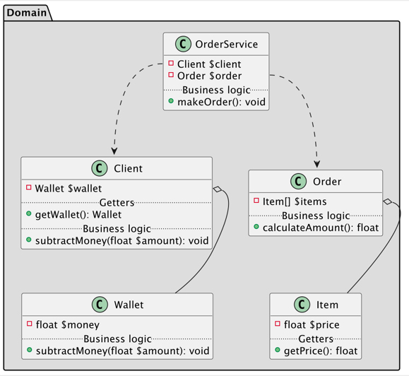

# The Law of Demeter (LoD)

Интерпретация закона Деметры на примере.
The Law of Demeter (LoD) or principle of least knowledge is a design guideline for developing software, particularly object-oriented programs.

